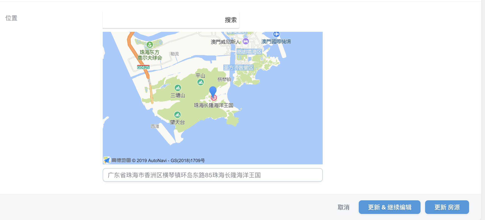

# nova-amap
Laravel Nova高德地图

#Installation

~~~php
composer require invoice/nova-amap
~~~

~~~php
use Ofancn\Amap\Amap;

public function fields(Request $request) {
        $location = $request->user()->location;
        return [
            ID::make()->sortable(),
            BelongsTo::make(__('用户'), 'user', User::class)->searchable(),
            Text::make(__('名称'), 'name')->sortable()->rules('required', 'string', 'max:255'),
            Amap::make(__('位置'), 'amap')->initLocation($location->latitude ?? 22.56153, $location->longitude ?? 113.4911)->zoom(12)->rules('required', 'json'),
        ];
}
~~~

